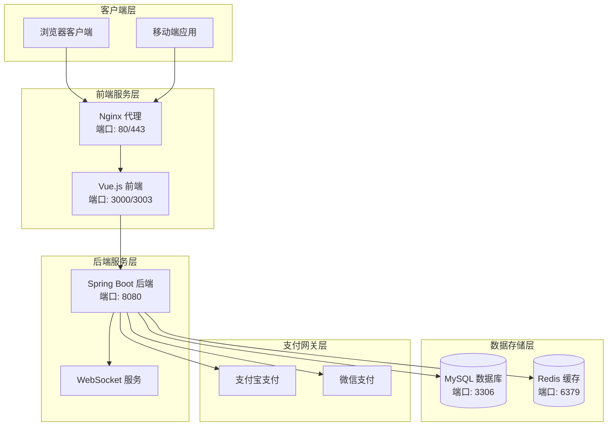
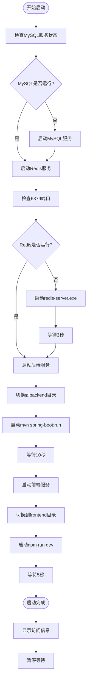

# 系统部署流程文档

<cite>
**本文档引用的文件**
- [start-services.bat](file://start-services.bat)
- [start-backend.bat](file://backend/start-backend.bat)
- [start-redis-server.bat](file://start-redis-server.bat)
- [restart-services.bat](file://restart-services.bat)
- [install-dependencies.bat](file://backend/install-dependencies.bat)
- [package.json](file://frontend/package.json)
- [vite.config.js](file://frontend/vite.config.js)
- [pom.xml](file://backend/pom.xml)
- [application-payment.yml](file://backend/src/main/resources/application-payment.yml)
- [init.sql](file://sql/init.sql)
- [README.md](file://README.md)
- [项目部署指南.md](file://docs/项目部署指南.md)
- [Redis安装和配置指南.md](file://Redis安装和配置指南.md)
</cite>

## 目录
1. [系统概述](#系统概述)
2. [部署架构](#部署架构)
3. [前置条件检查](#前置条件检查)
4. [服务启动流程详解](#服务启动流程详解)
5. [各服务详细说明](#各服务详细说明)
6. [端口配置与访问地址](#端口配置与访问地址)
7. [测试账号信息](#测试账号信息)
8. [服务验证方法](#服务验证方法)
9. [故障排除指南](#故障排除指南)
10. [部署最佳实践](#部署最佳实践)

## 系统概述

汽车洗车服务预约系统是一个现代化的全栈Web应用程序，采用前后端分离架构，包含完整的用户管理、服务预约、支付集成和管理后台功能。

### 技术栈组成

- **后端技术**：Spring Boot 3.x + MyBatis Plus + MySQL + Redis
- **前端技术**：Vue.js 3.x + Element Plus + Vite + WebSocket
- **支付集成**：支付宝 + 微信支付
- **实时通信**：WebSocket + Redis Pub/Sub

## 部署架构



**图表来源**
- [start-services.bat](file://start-services.bat#L1-L61)
- [vite.config.js](file://frontend/vite.config.js#L14-L22)
- [pom.xml](file://backend/pom.xml#L1-L156)

## 前置条件检查

### 系统要求

| 组件 | 最低要求 | 推荐配置 |
|------|----------|----------|
| CPU | 2核心 | 4核心或更高 |
| 内存 | 4GB RAM | 8GB RAM或更高 |
| 存储 | 20GB 可用空间 | 50GB SSD |
| 网络 | 稳定的互联网连接 | 100Mbps带宽 |

### 环境依赖

| 依赖项 | 版本要求 | 安装方式 |
|--------|----------|----------|
| Java | JDK 17+ | 手动安装或包管理器 |
| Node.js | v18.x+ | 手动安装或包管理器 |
| MySQL | 8.0+ | 手动安装或Docker |
| Redis | 6.0+ | 手动安装或Docker |

**章节来源**
- [项目部署指南.md](file://docs/项目部署指南.md#L1-L800)
- [README.md](file://README.md#L1-L92)

## 服务启动流程详解

系统提供了多种部署方式，其中最便捷的是使用批处理脚本自动化启动所有服务。

### 主启动脚本分析

主要的启动脚本是 `start-services.bat`，它按照严格的顺序启动各个服务组件：



**图表来源**
- [start-services.bat](file://start-services.bat#L1-L61)

### 启动顺序详解

1. **MySQL服务检查与启动** (第5-12行)
   - 使用 `sc query mysql` 检查MySQL服务状态
   - 如果未运行，使用 `net start mysql` 启动服务
   - 确保数据库服务可用性

2. **Redis服务启动** (第15-28行)
   - 检查6379端口是否被占用
   - 如果未运行且存在redis-server.exe，启动Redis服务
   - 使用 `timeout /t 3 /nobreak >nul` 等待3秒确保Redis完全启动

3. **后端服务启动** (第31-34行)
   - 切换到backend目录
   - 使用 `mvn spring-boot:run` 启动Spring Boot应用
   - 使用 `timeout /t 10 /nobreak >nul` 等待10秒

4. **前端服务启动** (第40-43行)
   - 切换到frontend目录
   - 使用 `npm run dev` 启动Vue.js开发服务器
   - 使用 `timeout /t 5 /nobreak >nul` 等待5秒

**章节来源**
- [start-services.bat](file://start-services.bat#L1-L61)

## 各服务详细说明

### MySQL数据库服务

#### 启动机制
- **检查方式**：`sc query mysql`
- **启动命令**：`net start mysql`
- **默认端口**：3306
- **数据库名称**：carwash_db

#### 数据库初始化
系统使用 `init.sql` 脚本进行数据库初始化，包含：
- 用户表结构和初始数据
- 服务项目表
- 时间段表
- 预约订单表
- 系统配置表
- 用户反馈表

#### 数据库配置
```yaml
spring:
  datasource:
    url: jdbc:mysql://localhost:3306/carwash_db?useUnicode=true&characterEncoding=utf8&useSSL=false&serverTimezone=Asia/Shanghai
    username: root
    password: 123456
    driver-class-name: com.mysql.cj.jdbc.Driver
```

**章节来源**
- [init.sql](file://sql/init.sql#L1-L398)
- [start-services.bat](file://start-services.bat#L5-L12)

### Redis缓存服务

#### 启动方式
系统支持多种Redis启动方式：

1. **本地安装**：使用 `redis-server.exe` 启动
2. **Docker容器**：使用 `docker run redis`
3. **Windows服务**：作为Windows服务启动

#### 配置参数
```yaml
spring:
  redis:
    host: localhost
    port: 6379
    password: 
    database: 0
    timeout: 3000ms
```

#### 启动脚本特点
- 检查6379端口占用情况
- 使用 `timeout /t 3 /nobreak >nul` 等待Redis完全启动
- 提供警告信息（Redis未安装时）

**章节来源**
- [start-redis-server.bat](file://start-redis-server.bat#L1-L46)
- [application-payment.yml](file://backend/src/main/resources/application-payment.yml#L1-L34)

### Spring Boot后端服务

#### 启动方式
- **开发模式**：`mvn spring-boot:run`
- **生产模式**：`java -jar target/carwash-reservation-system-1.0.0.jar`

#### 端口配置
- **HTTP端口**：8080
- **WebSocket端口**：8080（共享）

#### 关键配置
```bash
java -Dspring.profiles.active=dev \
     -Dserver.port=8080 \
     -Dspring.datasource.url=jdbc:mysql://localhost:3306/carwash_db?useUnicode=true&characterEncoding=utf8&useSSL=false&serverTimezone=Asia/Shanghai \
     -Dspring.datasource.username=root \
     -Dspring.datasource.password=123456 \
     -jar "target/carwash-reservation-system-1.0.0.jar"
```

#### 依赖管理
- **Maven**：使用Maven管理Java依赖
- **MyBatis Plus**：ORM框架
- **Spring Security**：安全框架
- **JWT**：认证令牌

**章节来源**
- [start-backend.bat](file://backend/start-backend.bat#L1-L20)
- [pom.xml](file://backend/pom.xml#L1-L156)

### Vue.js前端服务

#### 启动方式
- **开发模式**：`npm run dev`
- **生产模式**：`npm run build` + Nginx

#### 端口配置
- **开发端口**：3003（根据vite.config.js配置）
- **代理配置**：将 `/api` 请求代理到后端8080端口

#### 代理配置
```javascript
proxy: {
  '/api': {
    target: 'http://localhost:8080',
    changeOrigin: true,
    rewrite: (path) => path.replace(/^\/api/, '/api')
  }
}
```

#### 包管理
- **构建工具**：Vite
- **UI框架**：Element Plus
- **状态管理**：Pinia
- **路由管理**：Vue Router

**章节来源**
- [package.json](file://frontend/package.json#L1-L37)
- [vite.config.js](file://frontend/vite.config.js#L14-L22)

## 端口配置与访问地址

### 端口映射表

| 服务 | 默认端口 | 说明 | 访问地址 |
|------|----------|------|----------|
| MySQL | 3306 | 数据库服务 | 本地连接 |
| Redis | 6379 | 缓存服务 | 本地连接 |
| 后端服务 | 8080 | Spring Boot应用 | http://localhost:8080 |
| 前端开发 | 3003 | Vue.js开发服务器 | http://localhost:3003 |
| 前端生产 | 80 | Nginx代理端口 | http://localhost |

### 访问地址说明

#### 前端访问地址
- **开发环境**：http://localhost:3003
- **生产环境**：http://localhost（通过Nginx代理）
- **实时数据测试**：http://localhost:3003/real-data-test

#### 后端API地址
- **主API地址**：http://localhost:8080/api
- **Swagger文档**：http://localhost:8080/doc.html
- **健康检查**：http://localhost:8080/api/test/health

#### WebSocket地址
- **订单状态推送**：ws://localhost:8080/ws/order-status?userId=<当前用户ID>
- **心跳机制**：使用 `ping/pong`，前端定期发送 `ping`，后端返回 `pong`

**章节来源**
- [start-services.bat](file://start-services.bat#L52-L54)
- [vite.config.js](file://frontend/vite.config.js#L14-L22)
- [README.md](file://README.md#L42-L67)

## 测试账号信息

### 管理员账号
- **用户名**：admin
- **密码**：admin123
- **访问路径**：http://localhost:3003/admin
- **功能权限**：完整的后台管理功能

### 普通用户账号
- **用户名**：user001
- **密码**：user123
- **访问路径**：http://localhost:3003
- **功能权限**：预约服务、查看订单、个人资料管理

### 账号验证方法
1. **登录页面**：访问前端主页
2. **管理员登录**：点击登录按钮，选择管理员身份
3. **用户登录**：点击登录按钮，选择普通用户身份

**章节来源**
- [start-services.bat](file://start-services.bat#L56-L58)
- [init.sql](file://sql/init.sql#L183-L186)

## 服务验证方法

### 端口监听检查

#### 检查MySQL服务
```cmd
netstat -an | findstr :3306
```

#### 检查Redis服务
```cmd
netstat -an | findstr :6379
```

#### 检查后端服务
```cmd
netstat -an | findstr :8080
```

#### 检查前端服务
```cmd
netstat -an | findstr :3003
```

### 页面访问测试

#### 后端API健康检查
1. **访问地址**：http://localhost:8080/api/test/health
2. **预期响应**：`{"success":true,"message":"OK","data":null}`

#### Swagger文档检查
1. **访问地址**：http://localhost:8080/doc.html
2. **验证内容**：API文档列表正常显示

#### 前端页面检查
1. **访问地址**：http://localhost:3003
2. **验证内容**：
   - 页面正常加载
   - 导航菜单可用
   - API连接正常

### 数据库连接验证

#### MySQL连接测试
```sql
-- 测试连接
SELECT 1;

-- 检查数据库
SHOW DATABASES LIKE 'carwash_db';

-- 检查表结构
SHOW TABLES;
```

#### Redis连接测试
```bash
# 测试Redis连接
redis-cli ping

# 检查Redis状态
redis-cli info server

# 测试基本操作
redis-cli set testkey "testvalue"
redis-cli get testkey
```

### WebSocket连接测试

#### 使用浏览器控制台
```javascript
// 创建WebSocket连接
const ws = new WebSocket('ws://localhost:8080/ws/order-status?userId=1');

// 监听连接事件
ws.onopen = () => console.log('WebSocket连接已建立');
ws.onerror = (error) => console.error('WebSocket错误:', error);
ws.onmessage = (event) => console.log('收到消息:', event.data);

// 发送ping测试
ws.send(JSON.stringify({type: 'ping'}));
```

**章节来源**
- [项目部署指南.md](file://docs/项目部署指南.md#L773-L797)

## 故障排除指南

### 常见启动问题

#### MySQL服务启动失败
**症状**：MySQL服务未运行，启动失败
**解决方案**：
1. 检查MySQL服务状态：`sc query mysql`
2. 检查MySQL配置文件：`mysqld --help`
3. 检查端口占用：`netstat -an | findstr :3306`
4. 重启MySQL服务：`net start mysql`

#### Redis服务启动失败
**症状**：Redis服务未运行，连接被拒绝
**解决方案**：
1. 检查Redis可执行文件：`where redis-server`
2. 检查端口占用：`netstat -an | findstr :6379`
3. 手动启动Redis：`redis-server redis.windows.conf`
4. 使用Docker启动：`docker run -d -p 6379:6379 redis`

#### 后端服务启动失败
**症状**：Spring Boot应用启动失败
**解决方案**：
1. 检查Java环境：`java -version`
2. 检查Maven依赖：`mvn dependency:tree`
3. 检查数据库连接：修改application.yml配置
4. 查看日志：`tail -f logs/application.log`

#### 前端服务启动失败
**症状**：Vue.js开发服务器启动失败
**解决方案**：
1. 检查Node.js环境：`node -v`
2. 检查npm依赖：`npm install`
3. 检查端口占用：`netstat -an | findstr :3003`
4. 清理缓存：`npm cache clean --force`

### 网络连接问题

#### CORS跨域问题
**症状**：前端请求被浏览器拦截
**解决方案**：
1. 检查后端CORS配置
2. 使用代理服务器
3. 修改浏览器安全设置

#### 代理配置问题
**症状**：API请求无法转发到后端
**解决方案**：
1. 检查vite.config.js代理配置
2. 确认后端服务已启动
3. 检查防火墙设置

### 性能优化建议

#### 数据库优化
1. **索引优化**：为常用查询字段添加索引
2. **连接池配置**：调整数据库连接池大小
3. **查询优化**：优化慢查询语句

#### Redis优化
1. **内存配置**：合理设置maxmemory
2. **持久化策略**：配置RDB和AOF
3. **连接优化**：使用连接池

#### 前端优化
1. **资源压缩**：启用Gzip压缩
2. **缓存策略**：设置合适的缓存头
3. **懒加载**：对大组件使用懒加载

**章节来源**
- [项目部署指南.md](file://docs/项目部署指南.md#L680-L730)
- [Redis安装和配置指南.md](file://Redis安装和配置指南.md#L135-L202)

## 部署最佳实践

### 开发环境部署

#### 1. 环境准备
```bash
# 1. 安装必要的工具
choco install -y nodejs-lts
choco install -y openjdk17
choco install -y mysql
choco install -y redis

# 2. 配置环境变量
set JAVA_HOME=C:\Program Files\Java\jdk-17
set PATH=%JAVA_HOME%\bin;%PATH%
```

#### 2. 项目初始化
```bash
# 克隆项目
git clone <项目仓库地址>
cd 汽车洗车服务预约系统

# 安装依赖
cd backend
call install-dependencies.bat

cd ../frontend
npm install
```

#### 3. 数据库初始化
```sql
-- 创建数据库
CREATE DATABASE carwash_db CHARACTER SET utf8mb4 COLLATE utf8mb4_unicode_ci;

-- 导入初始数据
USE carwash_db;
SOURCE sql/init.sql;
```

#### 4. 启动服务
```bash
# 启动所有服务
start-services.bat
```

### 生产环境部署

#### 1. Docker部署
```yaml
# docker-compose.yml
version: '3.8'
services:
  mysql:
    image: mysql:8.0
    environment:
      MYSQL_ROOT_PASSWORD: root_password
      MYSQL_DATABASE: carwash_db
      MYSQL_USER: carwash_user
      MYSQL_PASSWORD: carwash_password
    ports:
      - "3306:3306"
    volumes:
      - mysql_data:/var/lib/mysql
      - ./sql/init.sql:/docker-entrypoint-initdb.d/init.sql

  redis:
    image: redis:6-alpine
    ports:
      - "6379:6379"
    volumes:
      - redis_data:/data

  backend:
    image: carwash-backend:1.0.0
    environment:
      SPRING_DATASOURCE_URL: jdbc:mysql://mysql:3306/carwash_db?useUnicode=true&characterEncoding=utf8&useSSL=false&serverTimezone=Asia/Shanghai
      SPRING_DATASOURCE_USERNAME: carwash_user
      SPRING_DATASOURCE_PASSWORD: carwash_password
      SPRING_REDIS_HOST: redis
      SPRING_REDIS_PORT: 6379
    ports:
      - "8080:8080"
    depends_on:
      - mysql
      - redis

  frontend:
    image: carwash-frontend:1.0.0
    ports:
      - "80:80"
    depends_on:
      - backend

volumes:
  mysql_data:
  redis_data:
```

#### 2. 监控和日志
```yaml
# docker-compose.monitoring.yml
version: '3.8'
services:
  prometheus:
    image: prom/prometheus:latest
    ports:
      - "9090:9090"
    volumes:
      - ./prometheus.yml:/etc/prometheus/prometheus.yml

  grafana:
    image: grafana/grafana:latest
    ports:
      - "3000:3000"
    environment:
      - GF_SECURITY_ADMIN_PASSWORD=admin
    volumes:
      - grafana_data:/var/lib/grafana
```

#### 3. 备份策略
```bash
# 备份脚本
#!/bin/bash
DATE=$(date +%Y%m%d_%H%M%S)
BACKUP_DIR="/backup"

# 备份数据库
docker exec carwash-mysql mysqldump -u root -proot_password carwash_db > $BACKUP_DIR/carwash_db_$DATE.sql

# 备份Redis数据
docker exec carwash-redis redis-cli save

# 压缩备份文件
gzip $BACKUP_DIR/carwash_db_$DATE.sql

# 清理旧备份
find $BACKUP_DIR -name "carwash_db_*.sql.gz" -mtime +7 -delete
```

### 安全配置

#### 1. 网络安全
```bash
# 防火墙配置
ufw allow 22/tcp
ufw allow 80/tcp
ufw allow 443/tcp
ufw deny 3306/tcp
ufw deny 6379/tcp
```

#### 2. 应用安全
```yaml
# 生产环境安全配置
spring:
  security:
    require-ssl: true
  
management:
  endpoints:
    web:
      exposure:
        include: health,info
  endpoint:
    health:
      show-details: never
```

#### 3. 容器安全
```dockerfile
# 使用非root用户运行
FROM openjdk:17-jre-slim
RUN addgroup --system carwash && adduser --system --group carwash
USER carwash
```

**章节来源**
- [项目部署指南.md](file://docs/项目部署指南.md#L773-L800)
- [README.md](file://README.md#L1-L92)