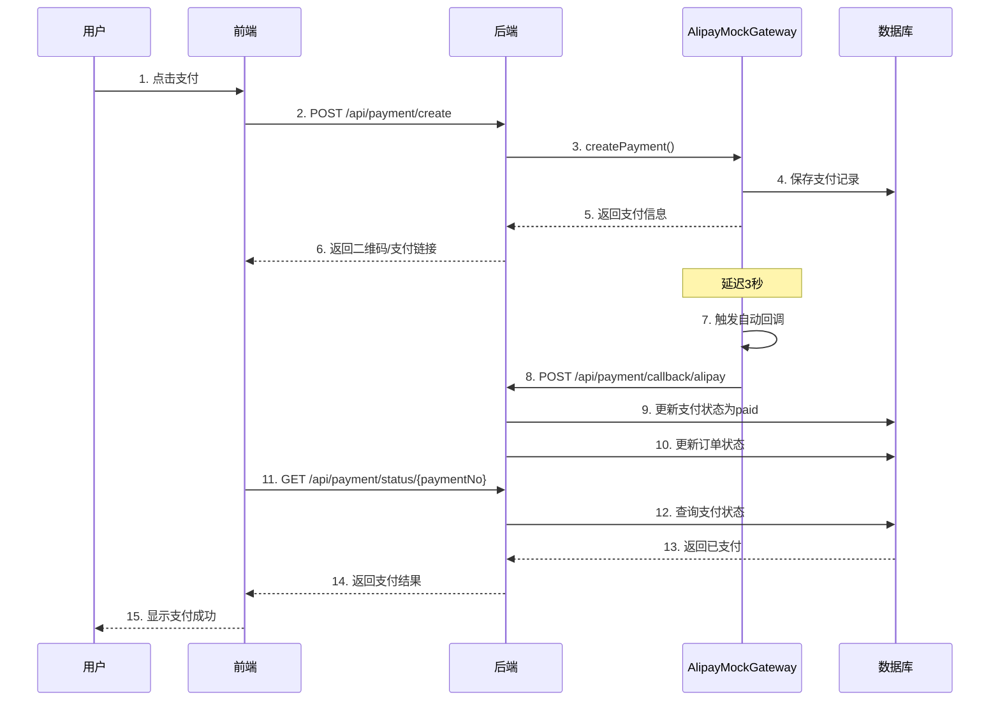

# 支付宝沙箱模拟支付功能说明

## 📋 功能概述

本功能实现了**支付宝沙箱模拟支付**,用于系统测试和演示,具有以下特点:

- ✅ **完整支付流程**:订单创建 → 支付请求 → 支付成功回调 → 订单状态更新
- ✅ **无资金流动**:模拟环境,不涉及真实资金扣款
- ✅ **自动回调**:创建支付后自动触发支付成功回调(延迟3秒)
- ✅ **真实流程**:完全模拟真实支付宝接口调用流程
- ✅ **测试友好**:适合开发测试、功能演示、用户验收

## 🎯 应用场景

1. **开发测试**:开发人员测试支付功能无需真实支付
2. **功能演示**:向客户演示完整支付流程
3. **用户验收**:用户验收测试时模拟支付场景
4. **集成测试**:自动化测试支付相关功能

## 🚀 快速开始

### 1. 后端实现

已实现的核心类:
```
backend/src/main/java/com/carwash/service/payment/AlipayMockGateway.java
```

该类实现了`PaymentGateway`接口,提供:
- `createPayment()` - 创建支付订单
- `queryPayment()` - 查询支付状态
- `refund()` - 申请退款
- `handleCallback()` - 处理支付回调

### 2. 前端测试页面

测试页面路径:
```
frontend/public/test-alipay-mock-payment.html
```

访问地址:
```
http://localhost:3000/test-alipay-mock-payment.html
```

### 3. API调用示例

#### 创建支付订单

```javascript
POST /api/payment/create
Content-Type: application/json
Authorization: Bearer {token}

{
  "orderNo": "ORD1234567890",
  "amount": 99.99,
  "paymentMethod": "alipay_mock",
  "description": "洗车服务预约"
}
```

**响应示例:**
```json
{
  "code": 200,
  "message": "success",
  "data": {
    "success": true,
    "paymentNo": "PAY_MOCK_1701234567890_ORD1234",
    "orderNo": "ORD1234567890",
    "amount": 99.99,
    "status": "pending",
    "qrCode": "https://qr.alipay.com/mock/...",
    "paymentUrl": "https://openapi.alipay.com/gateway.do?mock=true&...",
    "message": "【模拟支付】支付订单创建成功,将在3秒后自动支付成功"
  }
}
```

#### 查询支付状态

```javascript
GET /api/payment/status/{paymentNo}
Authorization: Bearer {token}
```

**响应示例(支付成功后):**
```json
{
  "code": 200,
  "message": "success",
  "data": {
    "success": true,
    "paymentNo": "PAY_MOCK_1701234567890_ORD1234",
    "orderNo": "ORD1234567890",
    "amount": 99.99,
    "status": "paid",
    "transactionId": "ALIPAY_MOCK_PAY_MOCK_1701234567890_ORD1234",
    "message": "查询成功"
  }
}
```

## 🔧 工作原理

### 支付流程图



### 关键特性

1. **自动回调触发**
   - 使用`@Async`注解实现异步回调
   - 延迟3秒模拟真实支付处理时间
   - 自动调用`/api/payment/callback/alipay`接口

2. **签名模拟**
   - 使用SHA-256生成模拟签名
   - 签名参数包含订单信息和时间戳
   - 完整模拟支付宝签名验证流程

3. **状态管理**
   - pending(待支付) → paid(已支付)
   - 使用ConcurrentHashMap存储临时状态
   - 支持多订单并发处理

## 📝 使用步骤

### 步骤1: 启动后端服务

```bash
cd backend
./mvnw spring-boot:run
```

### 步骤2: 访问测试页面

浏览器打开:
```
http://localhost:3000/test-alipay-mock-payment.html
```

### 步骤3: 创建支付订单

1. 输入订单号(可选,留空自动生成)
2. 输入支付金额(默认0.01元)
3. 选择支付方式:"支付宝沙箱模拟"
4. 点击"创建支付订单"按钮

### 步骤4: 等待支付成功

- 系统显示"pending"状态
- 3秒后自动触发支付成功回调
- 5秒后自动查询并显示"paid"状态

### 步骤5: 手动查询状态

点击"查询支付状态"按钮,查看最新支付状态

## 🎨 前端集成示例

```vue
<template>
  <div class="payment-container">
    <el-button type="primary" @click="createPayment">
      支付宝支付
    </el-button>
    
    <el-dialog v-model="paymentDialogVisible" title="支付">
      <div v-if="paymentInfo.qrCode" class="qr-code">
        
        <p>请使用支付宝扫码支付</p>
      </div>
      <div v-else>
        <p>{{ paymentInfo.message }}</p>
      </div>
    </el-dialog>
  </div>
</template>

<script setup>
import { ref } from 'vue'
import { paymentApi } from '@/api/payment'

const paymentDialogVisible = ref(false)
const paymentInfo = ref({})

const createPayment = async () => {
  try {
    const response = await paymentApi.createPayment({
      orderNo: 'ORD' + Date.now(),
      amount: 99.99,
      paymentMethod: 'alipay_mock', // 使用模拟支付
      description: '洗车服务预约'
    })
    
    paymentInfo.value = response.data
    paymentDialogVisible.value = true
    
    // 轮询查询支付状态
    pollPaymentStatus(response.data.paymentNo)
  } catch (error) {
    console.error('创建支付失败:', error)
  }
}

const pollPaymentStatus = (paymentNo) => {
  const timer = setInterval(async () => {
    try {
      const response = await paymentApi.getPaymentStatus(paymentNo)
      if (response.data.status === 'paid') {
        clearInterval(timer)
        paymentDialogVisible.value = false
        // 支付成功处理
        console.log('支付成功!')
      }
    } catch (error) {
      clearInterval(timer)
      console.error('查询支付状态失败:', error)
    }
  }, 2000) // 每2秒查询一次
}
</script>
```

## 🔒 安全说明

### 重要提示

⚠️ **本功能仅用于测试和演示,不适用于生产环境!**

- 不进行真实的签名验证
- 不对接真实支付宝接口
- 不产生实际资金流动
- 不记录真实交易凭证

### 生产环境迁移

如需接入真实支付宝接口,需要:

1. 注册支付宝开放平台账号
2. 创建应用并获取AppID
3. 配置RSA密钥(公钥/私钥)
4. 配置回调通知地址
5. 替换`AlipayGateway`实现为真实SDK调用

## 🐛 故障排查

### 问题1: 回调未触发

**症状**: 支付订单创建后,状态一直是pending

**解决方案**:
1. 检查`@EnableAsync`注解是否添加到启动类
2. 检查RestTemplate Bean是否正确配置
3. 查看后端日志是否有异常信息

### 问题2: 前端无法创建支付

**症状**: 点击支付按钮后提示错误

**解决方案**:
1. 检查是否已登录(需要JWT Token)
2. 检查API地址是否正确(http://localhost:8080/api)
3. 打开浏览器控制台查看网络请求详情

### 问题3: 订单状态未更新

**症状**: 回调触发了,但订单状态没变化

**解决方案**:
1. 检查数据库连接是否正常
2. 检查`payments`表和`bookings`表数据
3. 查看后端日志中的SQL执行情况

## 📊 测试数据

### 推荐测试场景

| 场景 | 订单号 | 金额 | 预期结果 |
|------|--------|------|----------|
| 正常支付 | 自动生成 | 0.01 | 3秒后支付成功 |
| 大额支付 | 自动生成 | 999.99 | 3秒后支付成功 |
| 并发支付 | 多个订单 | 任意 | 各自独立处理 |
| 重复支付 | 相同订单号 | 任意 | 返回已有支付信息 |

## 📚 相关文档

- [支付系统设计文档](./docs/api/支付系统设计-网关回调与审计.md)
- [支付安全文档](./docs/api/支付安全与信用卡接入.md)
- [系统开发计划书](./系统开发计划书.md)

## 🔄 后续优化

1. ✅ 支持微信支付沙箱模拟
2. ✅ 支持退款流程模拟
3. ✅ 支持支付失败场景模拟
4. ✅ 添加支付超时自动取消
5. ✅ 添加支付金额校验
6. ✅ 支持多种支付状态模拟

## 💡 开发提示

### 切换真实支付

修改支付方式从`alipay_mock`改为`alipay`:

```javascript
// 测试环境(模拟支付)
paymentMethod: 'alipay_mock'

// 生产环境(真实支付)
paymentMethod: 'alipay'
```

### 自定义回调延迟

修改`AlipayMockGateway.java`中的延迟时间:

```java
// 延迟3秒(默认)
TimeUnit.SECONDS.sleep(3);

// 修改为5秒
TimeUnit.SECONDS.sleep(5);

// 立即回调(用于快速测试)
// TimeUnit.SECONDS.sleep(0);
```

## ✅ 功能清单

- [x] 创建支付订单
- [x] 生成模拟二维码
- [x] 自动触发支付回调
- [x] 更新支付状态
- [x] 更新订单状态
- [x] 查询支付状态
- [x] 支付审计日志
- [x] 退款功能模拟
- [x] 前端测试页面
- [x] API接口文档

---

**版本**: v1.0  
**创建时间**: 2025-12-02  
**作者**: CarWash Team  
**维护状态**: ✅ 活跃维护
